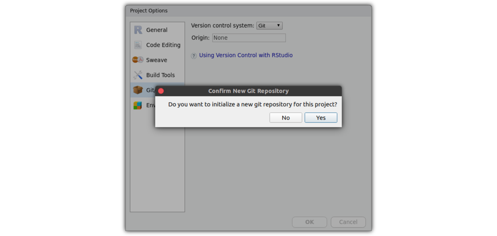

```{r setup, include=FALSE}
knitr::opts_chunk$set(echo = TRUE)
```

## How to set up a Package with {usethis}


### Creating the empty Package

Initialize the new empty package with {usethis}.
You might want to adjust the package location and path of your *package to be*.

```{r, eval = FALSE}
install.packages("usethis")
library(usethis)

path <- file.path("~/Desktop/testpkg")

usethis::create_package(path)
```

This will open a new Rstudio session that directly opens the new package Project.


### Initializing the git repository

You can initialize the git repository directly from within Rstudio.
For this you have to open the **Project Options...** (in the Rstudio **Tools** menu).
There, you can activate version control with Git --- this will initialize the git repository.



As for any git repository, we are also going to include a `README.md` file, indicating how people will be able to install our fancy new package.
For this, we need to know the name of the package/ git repository (`testpkg` in this case) as well as our github user name (`k-hench` in my case).

Our minimal readme file looks like this:

```md
# The testpkg Package

This is a small demo of a R package created with {usethis}.
It makes use of the helper packages {usethis}, {devtools}, {roxygen2} and {pkgdown} to quickly wrap R code into R packages.

To install this package please run this in R:

`​``
install.packages("remotes")
remotes::install_github("k-hench/testpkg")
`​``

But honestly --- there is not really a good reason for you to install this ^^

```

### Adjusting the Package details

You will need to adjust several details of you package such as the **Package Title**, **Author Name** and **Package description**.

You can update this information in the `DESCRIPTION` file within the new package.

The template `DESCRIPTION` file created by {usethis} looks like this:

```yaml
Package: testpkg
Title: What the Package Does (One Line, Title Case)
Version: 0.0.0.9000
Authors@R: 
    person(given = "First",
           family = "Last",
           role = c("aut", "cre"),
           email = "first.last@example.com",
           comment = c(ORCID = "YOUR-ORCID-ID"))
Description: What the package does (one paragraph).
License: `use_mit_license()`, `use_gpl3_license()` or friends to
    pick a license
Encoding: UTF-8
LazyData: true
Roxygen: list(markdown = TRUE)
RoxygenNote: 7.1.0
```

We are going to update the Package Title, Author details and license for now.
We can also use the `DESCRIPTION` file to specify *dependencies* of your code (other packages and package versions that are needed to run your `R` code).

After saving the alterations for `Title:`, `Authors@R:` and `Description:` fields, we can add a license by running eg. `usethis::use_mit_license()` (if you want to use for example the MIT license) in the `R` *console pane* of RStudio.
This will also alter the `License:` field of your `DESCRIPTION` file, but also create the files `LICENSE` and `LICENSE.md` in your package folder.

The adjusted `DESCRIPTION` file then looks like this:

```yaml
Package: testpkg
Title: Demo of a R package created with {usethis}
Version: 0.0.0.9000
Authors@R: 
    person(given = "Kosmas",
           family = "Hench",
           role = c("aut", "cre"),
           email = "khench@ab.mpg.de",
           comment = c(ORCID = "0000-0003-1119-187X"))
Description: Qucik intro to wrapping R code into R packes using {usethis} {devtools},, {roxygen2} and {pkgdown}.
License: MIT + file LICENSE
Encoding: UTF-8
LazyData: true
Roxygen: list(markdown = TRUE)
RoxygenNote: 7.1.0
```

(If you wanted to include dependencies, you would add the field `Depends:` and list package names there).

Now, in terms of preparation you are done `r emo::ji("smile")`.

### Adding custom R code

To populate your package with `R` objects and functions you need to add `R` scripts to the folder `R/`.

For demo purposes we are going to add one function and one object to a script called `R/demo.R`:

```r
indicate_concerns <- function(){
  ## give silly warning
  cat("O Dear!")
}

demo_table <- data.frame(x = 1:3,
                         y = 4:6)
```

### Documenting R functions using {roxygen2}

One added step when wrapping custom R scripts into R packages concerns your documentation of code.
Usually you might be a little more verbose in the documentation when writing packages.

Fortunately, there is great help with documenting content of R packages provided by the package {[roxygen2](https://roxygen2.r-lib.org/index.html)}.
This package makes it easy to provide structured documentation for your R functions and objets that are also accessible via the *help pane* of Rstudio (or the R help generally via eg. `?indicate_concerns`).

To use this, you need to add a specific comment block into your R script directly before you define the function/ object.
The comment blocks that are interpreted as {roxygen2} instructions are indicated by starting with `#'` (as compared to the standard R comments starting with a plain `#`).

As mentioned, these comment blocks have a specific structure, particularly they come with several sections that you can include to adjust documentation --- these include the First line (title of the Help page), as small one-sentence description, a more elaborate description of the function/ object as well as several tags such as `#' @seealso`, `#' @examples` and `#' @export`.

Particularly the inclusion of the `#' @export` tag is important, as without this one you function will not be visible after loading your package (`library(testpkg)`, you would need to address it specifically with `testpkg:::indicate_concerns()`).

After including the documentation of our dummy function and object, this is what the script `R/demo.R` looks like:

```r
#' Silly Warning
#'
#' \code{indicate_concerns} prompts a silly warning to the console
#'
#' This function was included for demo purposes.
#' It is used as a dummy function with some elaborate
#' documentation.
#'
#' @examples
#' indicate_concerns()
#'
#' @export
indicate_concerns <- function(){
  ## give silly warning
  cat("O Dear!")
}

#' Dummy Table
#'
#' \code{demo_table} provides a tiny dummy data set
#'
#' This data set was included for demo purposes.
#'
#' @examples
#' demo_table
#'
#' @export
demo_table <- data.frame(x = 1:3,
                         y = 4:6)
```

At this stage you can make use of {roxygen2} and {devtools} to automatize the documentation by running 
```r
devtools::document()
#> Updating testpkg documentation
#> Loading testpkg
#> Writing NAMESPACE
#> Writing indicate_concerns.Rd
#> Writing demo_table.Rd
```

This has created two documentation files (`indicate_concerns.Rd` and `demo_table.Rd`) and it has updated the file `NAMESPACE` (which makes the function available from your package --- the effect of the {roxygen2} tag `#' @export`)

### Creating a package homepage with {pkgdown}

Hold on --- you are almost done `r emo::ji("wink")`.

If you have completed the documentation you can create a package documentation homepage very quickly tanks to the `R` package {pkgdown}.
All that you need for this, is running:

```r
pkgdown::build_site()
```


